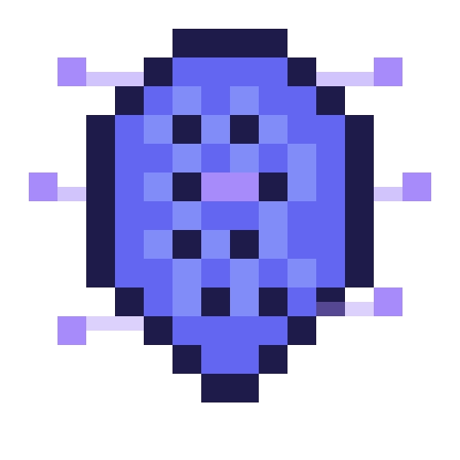

<p align="center">
  
</p>

<h1 align="center">Hivemind</h1>

<p align="center"><strong>Your AI company, visualized.</strong></p>

<p align="center">
Orchestrate multiple Claude Code CLI sessions as a virtual software company. Each agent has a role, personality, persistent memory, and authority level. You are the Board — speak to the CEO, watch your company work in real-time on a pixel-art RPG floor.
</p>

<!-- TODO: Replace with actual screenshot/demo GIF -->
<!--  -->

---

## What is Hivemind?

Hivemind spawns a hierarchy of AI agents — CEO, CTO, developers, reviewers, QA — each running as a real Claude Code CLI subprocess. They communicate through a typed message bus, delegate tasks, review each other's code, and escalate decisions to you when needed.

The GUI renders it all as a pixel-art office floor where 8-bit characters think, talk, and build software while you watch.

**It's not another agent framework.** It's a company simulator where AI agents have roles, accountability, and a Kanban board.

### Key Features

- **11 specialized agents** — CEO, CTO, CPO, COO, Senior Dev, Junior Dev, Code Reviewer, Designer, Design Reviewer, DevOps, QA
- **Real-time pixel-art GUI** — Watch agents work on "The Floor" with thought bubbles, connection lines, and status indicators
- **Tamagotchi interactions** — Praise, poke, or buy your agents a beer. Mood affects behavior.
- **Kanban ticket system** — Agents auto-create and manage tickets as work flows through the hierarchy
- **Company wiki** — Shared knowledge base across all agents
- **Streaming responses** — See agent thoughts in real-time as they work
- **Git integration** — Agents auto-commit their work with attribution
- **Inter-agent communication** — Typed message protocol with escalation chains
- **Customizable agents** — Edit any agent's personality, role, or authority via markdown files
- **CLI + GUI** — Full command-line interface alongside the visual experience

## Architecture

```
User --> Chat Panel --> WebSocket --> Orchestrator --> AgentProcess (claude CLI)
                                          |
                                    MessageBus (inter-agent)
                                          |
                                    TicketManager (auto-creates tickets)
                                          |
                                    Git (auto-commits agent work)
```

### Agent Hierarchy

```
YOU (Board/Owner)
  +-- CEO (authority: 5)
       +-- CTO (authority: 4)
       |    +-- Senior Developer (authority: 3)
       |    +-- Junior Developer (authority: 2)
       |    +-- Code Reviewer (authority: 3)
       +-- CPO (authority: 4)
       |    +-- Designer (authority: 3)
       |    +-- Design Reviewer (authority: 3)
       +-- COO (authority: 4)
            +-- DevOps (authority: 3)
            +-- QA (authority: 3)
```

Authority determines what an agent can decide alone vs. must escalate. Level 5 makes most decisions. Level 2 asks questions and learns.

## Quick Start

### Prerequisites

- **Node.js** >= 20
- **[Claude Code CLI](https://docs.anthropic.com/en/docs/claude-code)** installed and authenticated
- **pnpm** (`npm install -g pnpm`)

### Install & Run

```bash
git clone https://github.com/swisside999/hivemind.git
cd hivemind
pnpm install

# Terminal 1: Start the server
pnpm dev

# Terminal 2: Start the GUI
pnpm dev:web
```

Open `http://localhost:5173` in your browser.

### Create Your First Project

```bash
curl -X POST http://localhost:3100/api/projects \
  -H 'Content-Type: application/json' \
  -d '{"name":"my-app","displayName":"My App","workingDirectory":"/path/to/your/project"}'
```

Restart the server to load the project, then talk to the CEO in the chat panel.

### Docker

```bash
docker compose up
```

## CLI Usage

```bash
hivemind init my-project              # Create a new project (company)
hivemind start                        # Start server + GUI
hivemind start --headless             # No GUI, CLI only
hivemind ask "Build a REST API"       # Send a task to the CEO
hivemind agents                       # List all agents
hivemind agent ceo --status           # View agent details
hivemind projects                     # List projects
```

## Customizing Agents

Each agent is a markdown file with YAML frontmatter. Edit them directly or use the in-app Agent Editor.

```yaml
---
name: my-agent
display_name: "My Agent"
description: "What this agent does and when it should be activated"
role: custom
color: "#FF6B35"
icon_props: []
reports_to: cto
direct_reports: []
authority_level: 3
can_escalate_to_user: false
model: sonnet
---

Your system prompt here. Define personality, instructions, and behavior.
```

Agent files live in `projects/<name>/.hivemind/agents/<agent-name>/agent.md`. Templates are in `packages/server/templates/default-company/`.

## API Reference

### REST Endpoints

| Method | Path | Description |
|--------|------|-------------|
| GET | `/api/projects` | List all projects |
| POST | `/api/projects` | Create a project |
| GET | `/api/projects/:name` | Get project details |
| DELETE | `/api/projects/:name` | Delete a project |
| GET | `/api/agents` | List agents with state |
| GET | `/api/agents/:name` | Get agent details |
| POST | `/api/messages` | Send message to an agent |
| GET | `/api/messages` | Get message log |
| GET | `/api/escalations` | Get pending escalations |
| POST | `/api/escalations/:id/resolve` | Resolve an escalation |
| GET | `/api/state` | Get full system state |
| GET | `/health` | Health check |

### WebSocket Events

Connect to `ws://localhost:3101` for real-time updates:

| Event | Direction | Description |
|-------|-----------|-------------|
| `state:full` | Server -> Client | Full state on connect |
| `agents:configs` | Server -> Client | All agent configurations |
| `agent:thought` | Server -> Client | Agent's current activity |
| `agent:status` | Server -> Client | Agent status change |
| `message:routed` | Server -> Client | Inter-agent message sent |
| `escalation:new` | Server -> Client | New escalation for user |
| `escalation:resolved` | Server -> Client | Escalation resolved |
| `message:send` | Client -> Server | Send message to agent |
| `escalation:resolve` | Client -> Server | Resolve an escalation |

## Development

```bash
pnpm dev          # Start server (tsx watch, port 3100)
pnpm dev:web      # Start GUI (Vite, port 5173)
pnpm typecheck    # TypeScript strict check both packages
pnpm build        # Build for production
```

See [CONTRIBUTING.md](CONTRIBUTING.md) for the full development guide.

## Tech Stack

- **Monorepo:** pnpm workspaces
- **Server:** Node.js, TypeScript (strict), Express, WebSocket (ws)
- **Web:** React 19, Vite, Tailwind CSS v4, Zustand
- **Agents:** Claude Code CLI subprocesses with stream-json output
- **Storage:** File-based (JSON + markdown). No database.

## Roadmap

- [ ] **Skill system** — Agents invoke skills visible on The Floor
- [ ] **Intelligent model selection** — Auto-pick opus/sonnet/haiku per task complexity
- [ ] **Session usage awareness** — Display limits, auto-resume on reset
- [ ] **npm package** — `npx hivemind-ai init`
- [ ] **Agent XP & leveling** — Pixel art evolves with experience
- [ ] **Git worktree isolation** — Per-agent isolated branches
- [ ] **MCP protocol support** — Tool integration via Model Context Protocol
- [ ] **Sound effects** — 8-bit bleeps for events

See [progress.md](progress.md) for the full tracker.

## Contributing

Contributions welcome! See [CONTRIBUTING.md](CONTRIBUTING.md) for guidelines.

Ways to contribute:
- **New agent roles** — Create specialized agents ([template](https://github.com/swisside999/hivemind/issues/new?template=agent_definition.md))
- **Bug fixes** — [Report a bug](https://github.com/swisside999/hivemind/issues/new?template=bug_report.md)
- **Features** — [Request a feature](https://github.com/swisside999/hivemind/issues/new?template=feature_request.md)
- **Documentation** — Improve guides and examples

## License

[MIT](LICENSE)
